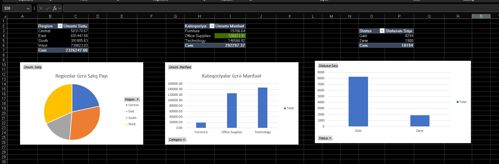

# 🚀 DevJoint Data Analytics Internship Program

Bu repozitoriya, DevJoint tərəfindən təşkil olunmuş 4 həftəlik Data Analitika təcrübə proqramı çərçivəsində hazırladığım praktiki tapşırıqları, SQL sorğularını, Excel analitikasını və biznes hesabatlarını özündə birləşdirir.

---

## 📁 Layihə Struktur və Həftəlik Keçidlər

Aşağıdakı cədvəldən hər bir həftənin qovluğuna və **ətraflı hesabatına (README)** keçid edə bilərsiniz:

| Həftə | Mövzu | İstfadə Olunan Alətlər | Ətraflı Hesabat |
| :--- | :--- | :--- | :--- |
| **Week 1** | SQL Əsaslardan Qabaqcıl Səviyyəyə | SQLite, SQL (JOINs, CTE, Window Functions) | [🔗 Readme-yə keçid](./Week_1_SQL_Basics_to_Advanced/README.md) |
| **Week 2** | Excel & Google Sheets Analitikası və Dashboard | Excel (XLOOKUP, INDEX/MATCH, Dynamic Dashboards) | [🔗 Readme-yə keçid](./Week_2_Excel_Google_Sheets_Analysis/README.md) |
| **Week 3** | Power BI / Python Data Visualization | Python, Power BI, DAX | [🔗 Readme-yə keçid](./Week_3_Python_PowerBI/README.md) |
| **Week 4** | Biznes Keys Analizi və Yekun Hesabatlıq | End-to-End Analytics, Presentation | [🔗 Readme-yə keçid](./Week_4_Business_Case_Analysis/README.md) |

---

## 👤 Müəllif
* **Turqay Tahirov** - *Data Analyst*

------------------------

# 📊 DevJoint Data Analytics Internship Program

Bu repozitoriya, **DevJoint** tərəfindən təşkil olunmuş 4 həftəlik Data Analitika təcrübə proqramı çərçivəsində hazırladığım bütün tapşırıqları, SQL sorğularını, data analizlərini və hesabatlarımı özündə birləşdirir.

---

### 📁 Layihə Quruluşu (Project Structure)

Layihə həftəlik tapşırıqlara uyğun olaraq aşağıdakı şəkildə strukturlaşdırılıb:

| Qovluq / Fayl | Təsvir |
| :--- | :--- |
| 📁 **`Week_1_SQL_Basics_to_Advanced/`** | SQL sorğuları (Əsas və JOIN-lar) |
| └── 📄 *`northwind.db`* | Layihədə istifadə olunan verilənlər bazası |
| 📁 **`Week_2_Excel_Google_Sheets_Analysis/`** | Excel analitikası və Dashboard |
| 📁 **`Week_4_Business_Case_Analysis/`** | Biznes Keys analizi və hesabat |

  
📸 **Dashboard faylının vizualı:**

✍️ **Müəllif:** Turqay Tahirov  
*Bu layihə DevJoint Təcrübə Proqramı çərçivəsində, real data üzərində analitik və biznes hesabatlığı bacarıqlarını nümayiş etdirmək üçün hazırlanmışdır.*
