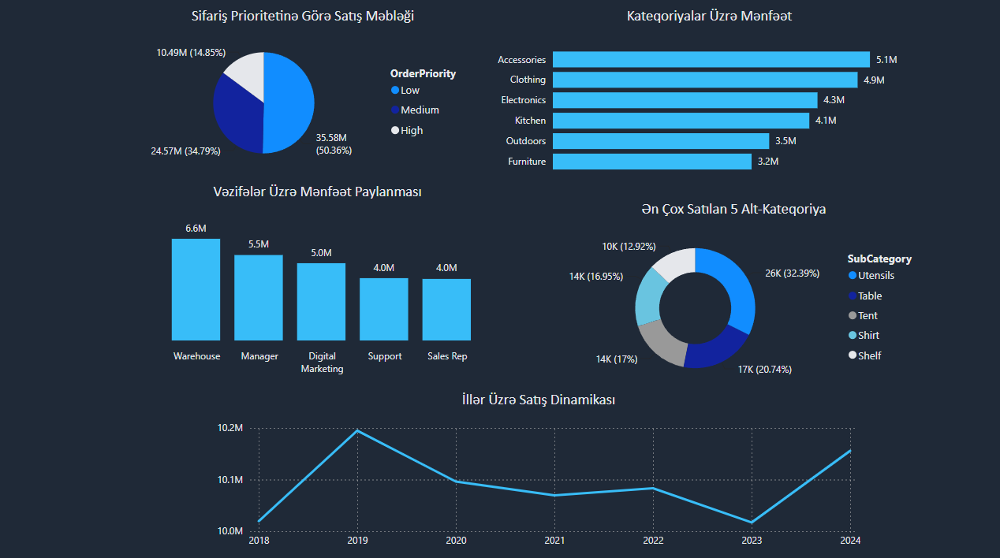
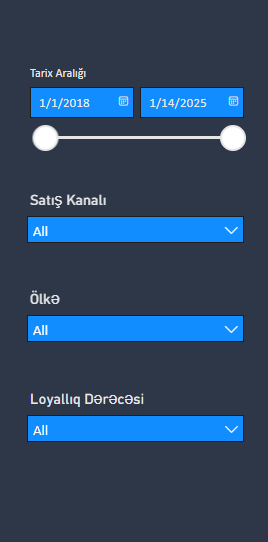
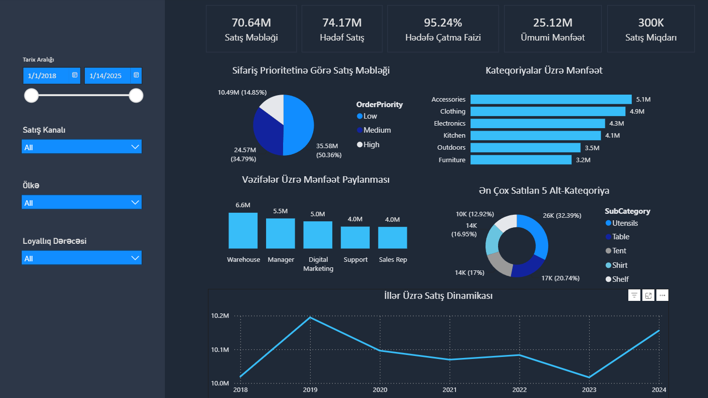

DevJoint InternShip Program - Week_3 - BI Dashboard (Tableau Public / Power BI)

## 📌 Layihə Haqqında İcmal
Bu layihə şirkətin satış dinamikasını, hədəflərə çatma dərəcəsini və kateqoriyalar üzrə mənfəətliliyini təhlil etmək üçün **Power BI** mühitində hazırlanmış interaktiv analitik dashboard proyektidir. Layihədə məlumatların inteqrasiyası, **Star Schema** modeli əsasında data modelləşdirmə, dinamik **DAX** ölçülərinin yaradılması və modern **Dark Theme UI/UX** standartlarına uyğun vizuallaşdırma həyata keçirilmişdir.

---

## 🏗️ Checkpoint 1: Data İmport və Data Modelləşdirmə

### 1. Məlumatların İnteqrasiyası (Data Import)
Məlumatlar CSV formatında sistemə import olunmuşdur:
* `FactSales` (Faktiki satış əməliyyatları cədvəli)
* `FactSalesTarget` (Satış hədəfləri cədvəli)
* `DimCustomer`, `DimProduct`, `DimEmployee`, `DimGeography`, `DimDate2` (Ölçü cədvəlləri)

### 2. Data Modelləşdirmə (Star Schema)
Avtomatik yaranan yanlış və passiv əlaqələr silinmiş, data modeli optimallaşdırılaraq **Star Schema** strukturuna gətirilmişdir. `FactSales` cədvəli mərkəzdə yerləşdirilərək dimension cədvəlləri ilə **1-to-Many (1:*)** əlaqələr qurulmuşdur:

* `DimCustomer [CustomerKey]` -> `FactSales [CustomerKey]`
* `DimProduct [ProductKey]` -> `FactSales [ProductKey]`
* `DimEmployee [EmployeeKey]` -> `FactSales [EmployeeKey]`
* `DimGeography [GeographyKey]` -> `FactSales [GeographyKey]`
* `DimDate2 [DateKey]` -> `FactSales [OrderDateKey]`
* `DimProduct [Category]` -> `FactSalesTarget [Category]` *(Hədəflərin analiz edilməsi üçün)*

---

## 📊 Checkpoint 2: Dataya Uyğun Seçilmiş Qrafik Tipləri

Hesabatda data strukturlarına tam uyğun gələn 5 fərqli qrafik tipindən istifadə olunmuşdur:

1. **Pie Chart – Sifariş Prioritetinə Göre Satış Məbləği:** Sifarişlərin prioritet dərəcəsinə (Low, Medium, High) görə paylanması.
2. **Clustered Bar Chart – Kateqoriyalar Üzrə Mənfəət:** Məhsul kateqoriyalarının gətirdiyi mənfəətin müqayisəli analizi.
3. **Stacked Column Chart – Vəzifələr Üzrə Mənfəət Paylanması:** Şirkət əməkdaşlarının (Warehouse, Manager, Digital Marketing və s.) mənfəətə olan töhfəsi.
4. **Donut Chart – Ən Çox Satılan 5 Alt-Kateqoriya:** Yüksək satış payına malik olan ilk 5 alt-kateqoriyanın təhlili.
5. **Line Chart – İllər Üzrə Satış Dinamikası:** Satış göstəricilərinin illər üzrə trend analizi.

### 💡 Əsas Analitik Tapıntılar (Key Insights):
* Ümumi satışların yarısından çoxu (**50.36%**) aşağı prioritetli (*Low*) sifarişlərin payına düşür.
* Ən çox mənfəət **Accessories** (5.1M) kateqoriyasından əldə edildiyi halda, ən aşağı mənfəət **Furniture** (3.2M) kateqoriyasına aiddir.
* Vəzifələr üzrə ən yüksək mənfəəti **Warehouse** heyəti (6.6M) təmin etdiyi halda, **Support** və **Sales Rep** rolları 4.0M ilə sonuncu sıradadır.
* Alt-kateqoriyalar arasında satış sayına görə **Utensils** (26K / 32.39%) digərlərindən nəzərəçarpan dərəcədə fərqlənir.
* Satış məbləğləri illər üzrə kəskin dəyişikliyə məruz qalmayıb, **10.0M – 10.2M** aralığında sabit xətt üzrə devam etmişdir. Şirkət ən yüksək satışı **2019-cu ildə (10.2M)** reallaşdırmışdır.



---

## 🎛️ Checkpoint 3: İnteraktiv Slicer/Filtrlər

Hesabatda məlumatları dinamik təhlil edə bilmək üçün 4 interaktiv slicer əlavə edilmişdir:

1. **Between Slicer – Tarix Aralığı:** Satış göstəricilərini konkret tarix aralığı üzrə filtrləyərək dövrü gedişatı izləmək üçün istifadə olunur.
2. **Dropdown Slicer – Satış Kanalı:** Satışların fərqli kanallar üzrə paylanmasını ayıran və ayrıca təhlil etməyə imkan verən filtr.
3. **Dropdown Slicer – Ölkə:** Göstəriciləri coğrafi baxımdan filterləyərək regionları müqayisə etmək üçün tətbiq olunub.
4. **Dropdown Slicer – Loyallıq Dərəcəsi:** Müştərilərin loyallıq səviyyəsinə (*Loyalty Tier*) görə satış mənfəətini analiz etməyə şərait yaradır.



---

## 🎯 Checkpoint 4: KPI Kartları

Biznes göstəricilərini operativ qiymətləndirmək üçün dashboard-un yuxarı hissəsində 5 ana KPI kartı yerləşdirilmişdir:

1. **Satış Məbləği (70.64M):** `FactSales` cədvəlindəki `SalesAmount` sütunu əsasında kartın dəyərinə əlavə olunub.
2. **Hədəf Satış (74.17M):** `FactSalesTarget` cədvəlindəki `TargetSalesAmount` sütunundan formalaşıb.
3. **Hədəfə Çatma Faizi (95.24%):** DAX ölçüsü (`Measure`) vasitəsilə satış məbləğinin (70.64M) hədəf satış məbləğinə (74.17M) nisbəti hesablanıb:
   ```dax
   Hədəfə Çatma Faizi = DIVIDE(SUM(FactSales[SalesAmount]), SUM(FactSalesTarget[TargetSalesAmount]), 0)

4. **Ümumi Mənfəət (25.12M):** `FactSales` cədvəlindəki `Profit` sütunu əsasında kartın dəyərinə əlavə olunub.
5. **Satış Miqdarı (300K):** `FactSalesTarget` cədvəlindəki `Quantity` sütunundan formalaşıb.

---


## 🎨 Checkpoint 5: Dashboard Dizaynı və UI/UX

* **Vizual İyerarxiya:** Əsas göstəricilər (KPI-lar) yuxarı paneldə, süzgəclər (Slicers) sol menyuda, detallı vizuallar isə mərkəzdə rahat oxunacaq strukturda yerləşdirilmişdir.
* **Ardıcıl Rəng Sxemi:** Modern tünd mövzu (Dark Theme) tətbiq olunmuş, kontrast təmin etmək üçün neon mavi və tünd göy tonlarından istifadə edilmişdir.
* **İnteraktiv Süzgəclər (Slicers):** Dashboard *Tarix Aralığı*, *Satış Kanalı*, *Ölkə* və *Loyallıq Dərəcəsi* süzgəcləri vasitəsilə dinamik filtrasiya olunur.



---

## 🧮 Checkpoint 6: Daxil Edilmiş DAX Ölçüləri (Measures)

Hesabatda nisbi müqayisələri və performans faizlərini hesablamaq üçün istifadə olunan DAX düsturları:

### 1. Hədəfə Çatma Faizi
```dax
Hədəfə Çatma Faizi = 
DIVIDE(
    SUM(FactSales[SalesAmount]), 
    SUM(FactSalesTarget[TargetSalesAmount]), 
    0
)
```
### 1. Mənfəət Faizi
```dax
Mənfəət Faizi = 
DIVIDE(
    SUM(FactSales[Profit]), 
    SUM(FactSales[SalesAmount]), 
    0
)
